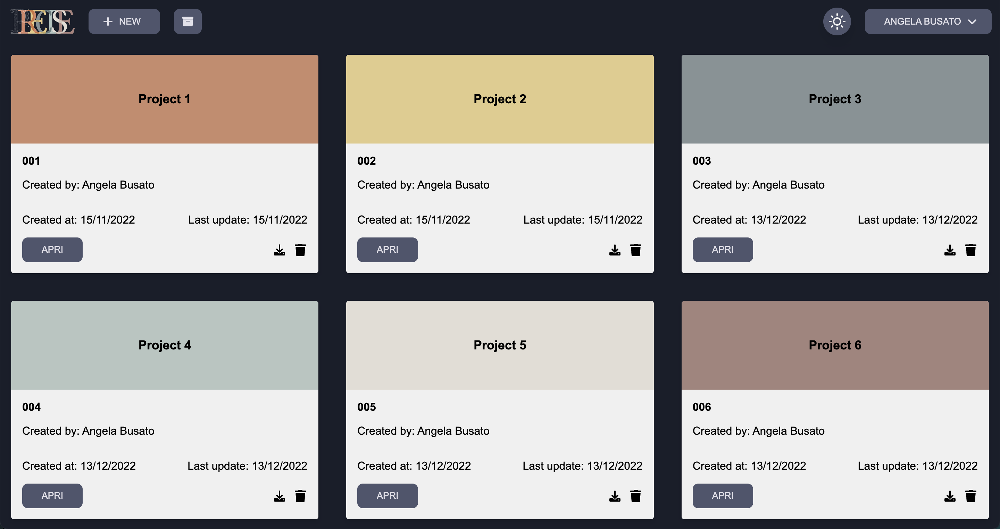
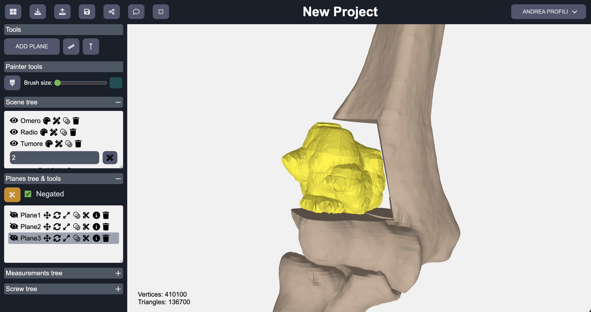

# Precise
Precise is a Web-Based 3D visualization and editing application for surgical simulation of tumor resection.

The authors wish to acknowledge the Tuscany Region (Italy) for co-funding the PRECISE project (BANDO RICERCA SALUTE 2018), which originated and made possible this research.

     

          
     

     

          
     

## Table of Contents

  
Table of Contents

  <ol>
    <li>
        <a href="#about-the-project">About The Project</a>
    </li>
    <li>
      <a href="#tech-stack">Tech stack</a>
    </li>
    <li>
      <a href="#getting-started">Getting Started</a>
      <ul>
        <li><a href="#setup">Setup</a></li>
      </ul>
    </li>
  </ol>

## About the project
The Precise application is part of the [Precise Project](https://www.preciseproject.it/). The idea originating the PRECISE project comes from the urgent need of researching, innovate, integrate and validate existing and novel 3D technologies in a new objective unified framework for enabling in the current clinical practice, patient-specific methods and tools for the training, the simulation, the intervention and the follow-up of personalized surgical approaches. Such technologies include CAD, Reverse Engineering, Additive Manufacturing, and Virtual and Augmented Reality.  
The Precise application is developed to create a project, import STL files, and visualize those files as 3D images and it gives the possibility to edit and interact with these images through specialized tools. The application is compatible with tablets.

**Related Article:** [SoftwareX - Precise: A web-based 3D visualization and manipulation application for surgical planning of tumour resection](https://www.sciencedirect.com/science/article/pii/S2352711023000948)

## Tech stack
The application is divided into two parts, the client and the server. it is written completely in JavaScript. Following the technologies used to develop the application:

**Frontend**

- [Three.js](https://threejs.org/) - *JavaScript* library used to create and display animated 3D computer graphics in a web
- [React](https://reactjs.org/) - *JavaScript* library for building user interface
- [Webpack 5](https://webpack.js.org/) - *JavaScript* module bundler.

**Backend**

- [Node.JS](https://nodejs.org/it/) - An open source server environment
- [Express](https://expressjs.com/it/) - A framework for Node.js web application
- [Knex](https://knexjs.org/) - SQL Query Builder for Javascript
- [Postgresql](https://www.postgresql.org/) - A relational database
## Getting Started

### Requirements
- `node: >=14`
- `npm`

### Setup

[Frontend README](https://github.com/AngyDev/custom-3D/tree/main/client/README.md)

[Backend README](https://github.com/AngyDev/custom-3D/tree/main/server/README.md)
